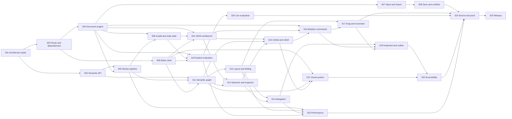

# Lion Graph Editor — Product Epic

**Status:** Complete

## Outcome

Ship a local-first web editor where Lion developers open a JSON program, navigate and edit it through synchronized semantic graph and source views, evaluate it, and save the same source back to disk. The editor must remain usable with programs exceeding 1,000 nodes.

## Product contract

- `sourceText` is canonical. The graph is always a derived view.
- Graph edits become minimal source-text transactions and share one undo history with source edits.
- The selected visual and interaction direction is **One-Sheet Fold Map**: semantic expressions are folded views of exact JSON structure.
- The first release uses the standard library environment only.
- Direct file writes target browsers with the File System Access API; import/download is the required fallback.
- Manual graph positions are ephemeral and never written into Lion source.
- Per-expression runtime tracing, cloud persistence, collaboration, plugins, and custom environments are out of scope.

## Ticket rules

Each ticket is independently reviewable after its dependencies land. Acceptance criteria describe observable behavior. Verification must exercise the changed surface; tests are added only for durable behavioral contracts.

## Tickets

| ID | Ticket | Phase | Depends on |
| --- | --- | --- | --- |
| LION-EDITOR-001 | [Validate the round-trip editing architecture](001-round-trip-architecture-spike.md) | Foundation | — |
| LION-EDITOR-002 | [Add a public Lion semantic-analysis API](002-core-semantic-analysis.md) | Foundation | 001 |
| LION-EDITOR-003 | [Establish the editor route and dependencies](003-editor-route-and-dependencies.md) | Foundation | 001 |
| LION-EDITOR-004 | [Build the canonical document engine](004-canonical-document-engine.md) | Foundation | 001, 003 |
| LION-EDITOR-005 | [Move analysis and layout behind a worker protocol](005-editor-worker-pipeline.md) | Foundation | 002, 004 |
| LION-EDITOR-006 | [Handle invalid source and stale graph state](006-invalid-source-and-stale-graph.md) | Foundation | 004, 005 |
| LION-EDITOR-007 | [Implement new, open, and import workflows](007-open-and-import-files.md) | File lifecycle | 003, 004 |
| LION-EDITOR-008 | [Implement saving, dirty state, and file conflicts](008-save-dirty-and-conflicts.md) | File lifecycle | 007 |
| LION-EDITOR-009 | [Build the editor shell and pane topology](009-editor-shell.md) | Workspace | 003 |
| LION-EDITOR-010 | [Build the JSON workbench and shared history](010-json-workbench-and-history.md) | Workspace | 004, 006, 009 |
| LION-EDITOR-011 | [Render the semantic graph](011-semantic-graph.md) | Graph | 002, 005, 009 |
| LION-EDITOR-012 | [Scale graph layout through folding and culling](012-scalable-layout-and-folding.md) | Graph | 011 |
| LION-EDITOR-013 | [Synchronize selection and build the inspector](013-selection-sync-and-inspector.md) | Graph | 010, 011 |
| LION-EDITOR-014 | [Add graph navigation and overview tools](014-navigation-search-and-overview.md) | Graph | 012, 013 |
| LION-EDITOR-015 | [Implement semantic unfold and refold](015-unfold-and-refold.md) | Graph | 010, 011, 013 |
| LION-EDITOR-016 | [Implement graph mutation commands](016-graph-mutation-commands.md) | Graph editing | 004, 010, 011, 015 |
| LION-EDITOR-017 | [Add validated drag, reorder, and reconnect](017-drag-reorder-and-reconnect.md) | Graph editing | 012, 016 |
| LION-EDITOR-018 | [Add command palette, keyboard control, and outline](018-keyboard-command-palette-and-outline.md) | Graph editing | 014, 016, 017 |
| LION-EDITOR-019 | [Add explicit evaluation and result diagnostics](019-explicit-evaluation.md) | Execution | 004, 006, 009 |
| LION-EDITOR-020 | [Add live evaluation and cancellation](020-live-evaluation.md) | Execution | 019 |
| LION-EDITOR-021 | [Apply the One-Sheet Fold Map visual system](021-one-sheet-visual-system.md) | Finish | 009, 011, 015 |
| LION-EDITOR-022 | [Harden accessibility and adaptive input](022-accessibility-and-adaptive-input.md) | Finish | 018, 021 |
| LION-EDITOR-023 | [Meet large-program performance targets](023-performance-hardening.md) | Finish | 005, 012, 014, 019 |
| LION-EDITOR-024 | [Prove complete product workflows](024-end-to-end-workflows.md) | Release | 008, 017, 020, 022, 023 |
| LION-EDITOR-025 | [Document, clean up, and release the editor](025-release-cleanup-and-documentation.md) | Release | 024 |

## Dependency graph

## Release gate

The product is complete only when ticket 024 proves the real workflows in a browser and ticket 025 removes superseded prototypes, updates user-facing documentation, and records the shipped design system. Passing unit tests alone is not completion.

## Completion evidence

All 25 implementation tickets are complete. The release gate is satisfied by the desktop and narrow end-to-end workflow suite, the production open-edit-run-save smoke scenario, the documented One-Sheet Fold Map design system, and removal of superseded prototype surfaces.
